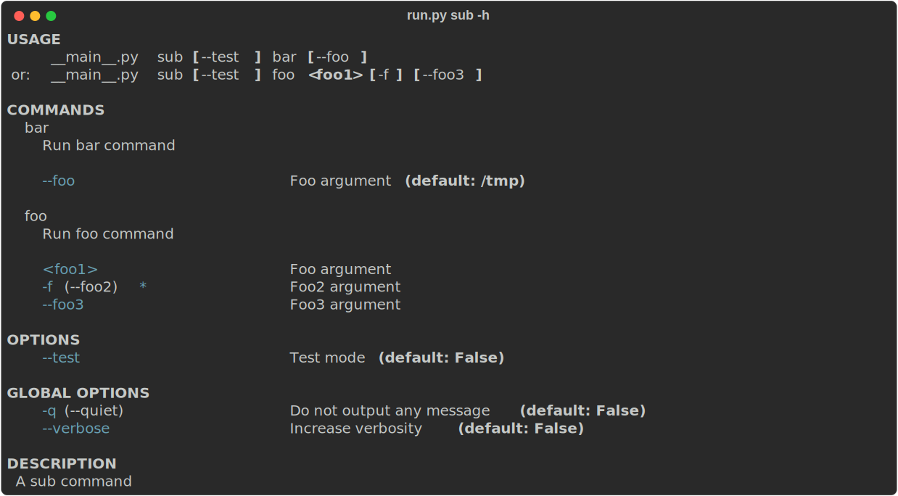

## Commands

Commands are the core building blocks of your CLI. You define them using decorators.

```python
from piou import Cli, Option

cli = Cli(description='A CLI tool')

@cli.command(cmd='foo', help='Run foo command')
def foo_main(
        foo1: int = Option(..., help='Foo arguments'),
        foo2: str = Option(..., '-f', '--foo2', help='Foo2 arguments'),
        foo3: str | None = Option(None, '-g', '--foo3', help='Foo3 arguments'),
):
    pass
```

In this case:
- `foo1` is a **positional** argument.
- `foo2` and `foo3` are **keyword** arguments (flags).

### Global Options

You can specify global options that apply to all commands:

```python
cli = Cli(description='A CLI tool')
cli.add_option('-q', '--quiet', help='Do not output any message')
```

### Docstrings as Descriptions

The description can also be extracted from the function docstring:

```python
@cli.command(cmd='bar2')
def bar_2_main():
    """
    Run foo command
    """
    pass
```

### Async Support

A command can also be asynchronous; it will be run automatically using `asyncio.run`.

```python
@cli.command(cmd='bar', help='Run foo command')
async def bar_main():
    pass
```

## Without Command (Main)

If you want to run a function without specifying a command (like a single-purpose script), use the `@cli.main()` decorator or `is_main=True`.

```python
@cli.main()
def run_main():
    pass
```

Run it directly:
```bash
python -m examples.simple_main -h
```

**Note**: You can only have one `main` function in the CLI.

## Command Groups / Sub-commands

You can nest commands arbitrarily deep using sub-parsers.

```python
sub_cmd = cli.add_sub_parser(cmd='sub', help='A sub command')
sub_cmd.add_option('--test', help='Test mode')

@sub_cmd.command(cmd='bar', help='Run bar command')
def sub_bar_main(**kwargs):
    pass
```

Running `python run.py sub -h` will show the specific help for that group.



## Options Processor

Sometimes you need to intercept global options before a command runs (e.g., to set up logging level).

```python
from piou import Cli, Option

cli = Cli(description='A CLI tool')

@cli.processor()
def processor(verbose: bool = Option(False, '--verbose', help='Increase verbosity')):
    print(f'Processing {verbose=}')
```

By default, processed options are consumed. To pass them down to the command functions as well, use `propagate_options=True` when creating the `Cli` or sub-parser.
